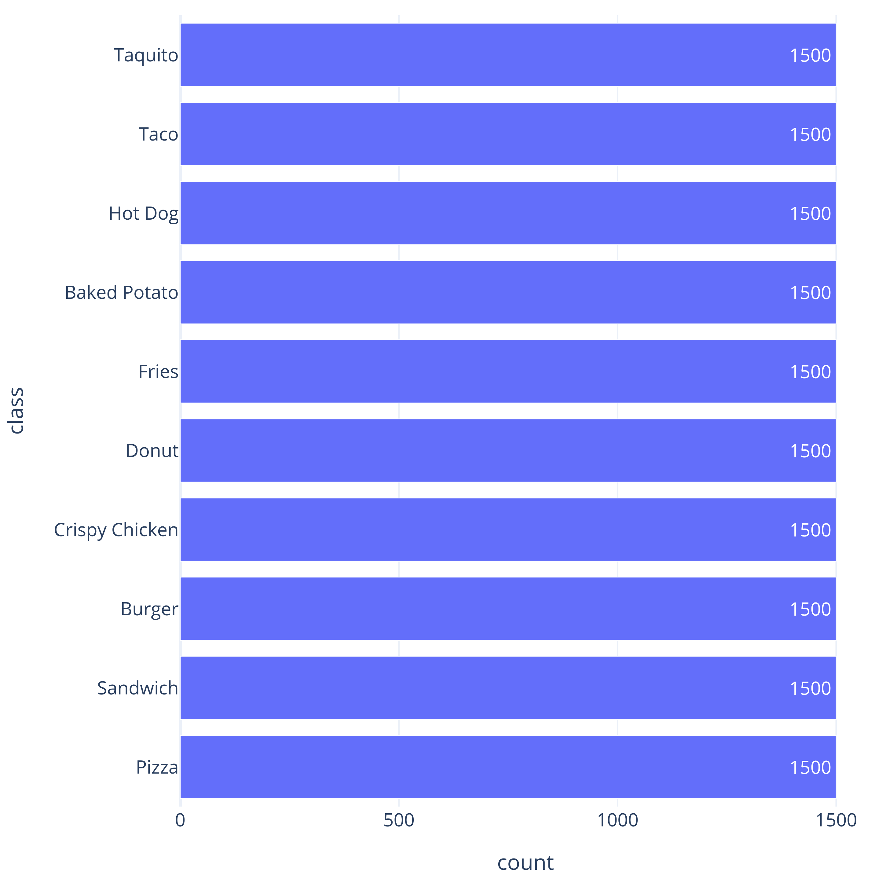
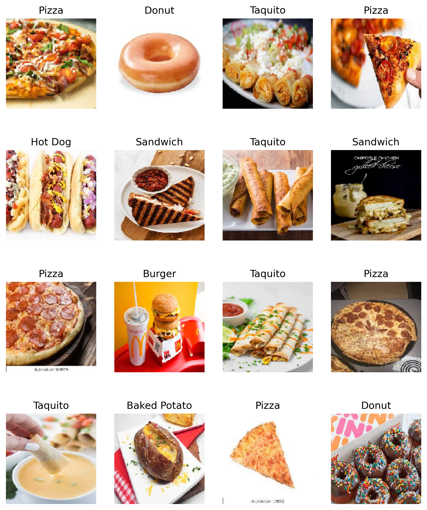
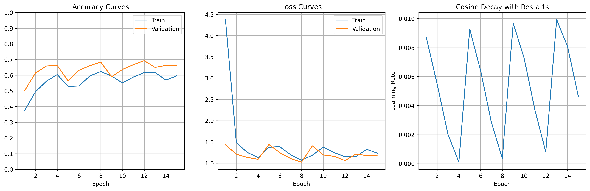
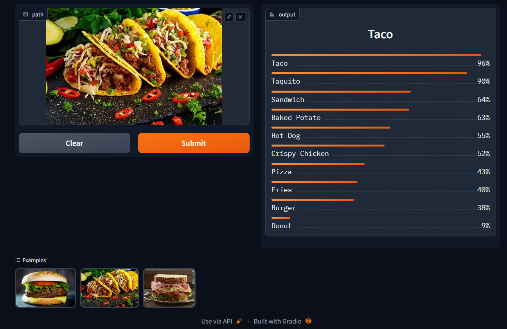

# Fast Food Classifier

This classifier is build using a pretrained model (EfficientNetB7) in join with a vanilla neural network at the top of the model. The main goal is to classify all classes from [Fast Food Dataset V2](https://www.kaggle.com/datasets/utkarshsaxenadn/fast-food-classification-dataset). To avoid extra computational load during the classifier training, the base model is used first as a feature extractor for create a dataset of features and labels, then, the top model is training with this new dataset. Finally the complete model is assembled and tested with new images.

In this project the vanilla neural network was trained with Adam optimizer and cosine decay with restart for exploring the effect on the metrics.

## Data
Version 2 extends the version 1 of the fastfood classification data set and introduces some new classes with new images. These new classes are :

- Baked Potato
- Crispy Chicken
- Fries
- Taco
- Taquito

The data set is divided into 4 parts, the Tensorflow Records, Training Data, Validation Data** and Testing Data.

In this project only Training Data and Validation data were used, because these are raw images. This dataset is balanced:

And is composed of a wide variety of images:

## Preprocessing
Only resize operations were applied in join with EfficientNet Preprocess built in method.

## Training and results
Training was set as:
- Optimizer: Adam
    - Initial learning rate: 0.01
    - Decay: Cosine
    - Decay steps: 1000
- Epochs: 15
- Batch Size: 64
- Metrics: Accuracy
- Loss: Categorical Cross Entropy

Learning curves:

## Test and deployment
Next pictures show the performance of the classifier with new images in a gradio app, comming son hosted on HuggingFace Spaces.

